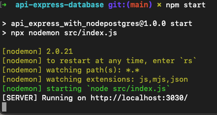

# Express Database

In this workshop we're going to look at how to use express with a postgres database.

## Learning Objectives
* Explain how REST API methods interact with a relational database
* Implement a REST API backed by a database using express and postgres

## Setup

1. Fork this repository
2. Clone the forked repository onto your local machines
3. In the root directory, type `npm install`, which installs dependencies for the project

For this exercise we will also need to configure our database:

4. In ElephantSQL, create a new instance

_Figure 1: A new ElephantSQL database instance_

4. Copy the SQL statements from the files in the `sql` folder and run them in your Elephant SQL browser. This will create the tables we need for this exercise as well as some test data.

* create-books.sql
* create-pets.sql
* insert-books.sql
* insert-pets.sql

5. Copy the URL of your new instance

6. Create a file `.env` in the __root directory__ of your project. It should be right next to the `.env.example` file. It should contain a single line, which contains the *environment variable* used to specify the url from the instance created above. See the example file for reference.

7. Type `npm start`, which starts a development server that will reload whenever you make any changes to source files.

All being well, you will have a terminal window that looks like the following:

_Figure 2: The terminal window where the express server is running successfully_

## Interacting with the Database
To interact with the database we will use the [node-postgres](https://node-postgres.com/) library. We will use the [query](https://node-postgres.com/features/queries) method to send SQL queries to the database sever and receive responses. The `db/index.js` file establishes the connection to the database. Your instructor will walk through this with you.

## Demo
Your instructor will demonstrate implementing the books API, now using a real database. You will then implements the Pets API.

## Instructions
* [Part 1](./docs/part1)
* [Part 2](./docs/part2)

## Tips
- Take a look inside the `sql` folder to see what data types with which you are working with.
- Use ElephantSQL to check if your requests are successfully creating rows in the database (there will be seed data stored in there already).
